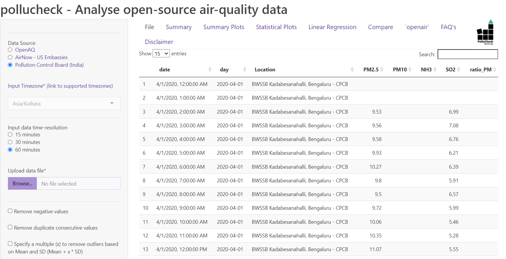

# Hello!

My name is Adithi, and I am a Geospatial Data Analyst at ILK Labs in Bangalore and this is my first useR! I use R to work with air quality data. Today, I will present about how I used shiny to build tools to provide a workflow to analyse air quality data.


---

# R in the aiR!

```{r out.width = "100px", echo = FALSE}

knitr::include_graphics("WWW/R.png")

```

- R and shiny are a powerful combination to work hands-on air-quality data. 

- The amount of data being collected is huge and necessitates the use of management platforms. 


???

R in the air! 

R and shiny are a powerful couple which can be used to build interactive platforms to manage and work with the data collected.

With the ever increasing global measurements of air pollutants (through stationary, mobile, low-cost, and satellite monitoring), the amount of data being collected is huge and it necessitates the use of management platforms.

In an effort to address this issue, we developed two Shiny applications to analyse and visualise air quality data.


---

# Necessity is the mother of Invention 

- Apps can be deployed

- No programming knowledge required

- Help is always around

???

As they say - necessity is the mother of invention. We, at ILK Labs always wanted to work with high dimensional data and talk air quality, to make it possible we designed and developed two applications.

Shiny apps are user friendly, so team members across continents can use the applications without any prior knowledge of programming. 

Another added benefit is having a vibrant and supportive community using R. Both these applications have pre-loaded datasets to work around. 


---
class: center

# Mobile Monitoring 


.center[Apte et. al(2017)]

???

The first shiny application is called "mmapshiny" which helps in processing high resolution air quality data collected on a moving platform usually called mobile monitoring. 

So we take multiple sensors in a car, and take repeated measurements of each road in an area to generate stable high resolution air pollutant maps (usually daily maps are generated). 

There is superior performance in estimating long-term mean concentrations when multiple repeated drives are possible.

---

class: center

# [mmaqshiny](https://aruapps.shinyapps.io/mmaqshiny/)


```{r out.width = "800px", echo = FALSE}


```

???

This is how mmaqshiny looks like. 

---

# mmaqshiny
```{r out.width = "100px", echo = FALSE}

knitr::include_graphics("WWW/mmaqshiny.png")

```

- Handles high frequency data (~ 1 Hz)

- Visualise air pollution hot spots

- Pre-processes for various instrumental sensitivities

- Joins output files from different instruments

- Reduces computational labour

- Alarms user on instrumental errors

- Near real time quality check of the data (usually after the ride)


???

mmaqshiny can handle data of the order 1000's every day from each of the instrument, we had nearly 5 instruments for this study. 

It reduces the time consumed for analysing each pollutant individually, helps in visualising the data collected on field each day, it can also be used to look for pollution hotspots, locations that are relatively more polluted than neighboring areas. 

Each pollutant or sensor data requires specific kind of pre-processing which depends on the principle on which it operates or its mechanical setup. Eventually, it joins different instrument data into one single corrected file.


This really helps us in achieving the unit of analysis for the rest of the study. 

This application has reduced computational labour. Since mobile data contains a huge amount of spatial data, GPS data file is mandatory but other files from different instruments are not necessary. 

Since Alarm tab is also present in the application, it helps the user to give a near real-time check on the health of all the instruments used. This application is available as a package on CRAN.  


---
class: center

# Stationary Monitoring 

```{r out.width = "200px", echo = FALSE}


```

.center[CSTEP, Bangalore, India]

???

The second shiny application "pollucheck" helps processing open source air quality data usually called stationary monitoring. 

There are several platforms which provide open source air quality data. We built this application for users of these platforms who can have quick analysis and basic plots of air quality easily generated and think about science. 

---

class: center

# [pollucheck](https://aruapps.shinyapps.io/OpenSourceAirQualityApp)


```{r out.width = "800px", echo = FALSE}



```

???

This is how pollucheck looks like. 

---

# pollucheck
```{r out.width = "100px", echo = FALSE}

knitr::include_graphics("WWW/PolluCheck.png")


```

- sources compatible - [CPCB (specific to India)](https://app.cpcbccr.com/ccr/#/caaqm-dashboard-all/caaqm-landing), [OpenAQ](https://openaq.org/#/countries/IN?_k=5ecycz), and
[AirNow](https://www.airnow.gov/international/us-embassies-and-consulates/#India)

- Data processing options available along with different summary statistics

- Generates statistical and summary plots

- Implements linear or multilinear regression 

- Allows users to compare from two sites

???

"pollucheck" can be used for data downloaded from CPCB (specific to India), OpenAQ and AirNow, it aims at generating a range of statistical plots and summary statistics with several data processing options. 

There are options for different averaging periods as well. It also checks for normality, generates density, Q-Q plots along with all these checks for trends in the time series for the selected parameter. 

It can implement linear or multilinear regression. pollucheck allows users to upload another set of data to compare selected parameters and generate plots. 

It also implements two plots from the openair package. 

This is made into a package and will be on its way to CRAN soon. Don't forget to check out air quality of your city using our application! 

---

# R packages!

- `shiny`!! 

- Tidying the data: `tidyverse`

- Manipulating timestamps: `lubridate`

- Joining the file using mutating joins

- `openair`

- and many more.....


???

A huge shout out to all the packages which made these applications possible. 
Manipulating different timestamp has been the most challenging part since there are different time stamp format and the multiple timezones. 

Integrating a number of instruments has also been a task, joining all files together to make a single file saves a lot of time for further analysis. 

Tidyverse, I guess is a must in all data analysis. 

---

## Thank you and to know more or to provide feedback find me - 

Email - [adithi@ilklabs.com](adithi@ilklabs.com)

GitHub - [@adithirgis](https://github.com/adithirgis)

Twitter - [@AdithiUpadhya](https://twitter.com/AdithiUpadhya)

???

Please let me know if you all have any further questions. I am also available in the Lounge if you want to discuss. Have a great day ahead! Enjoy useR!
